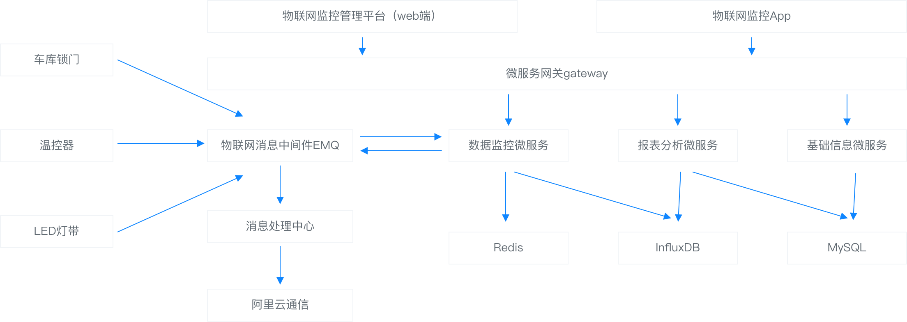
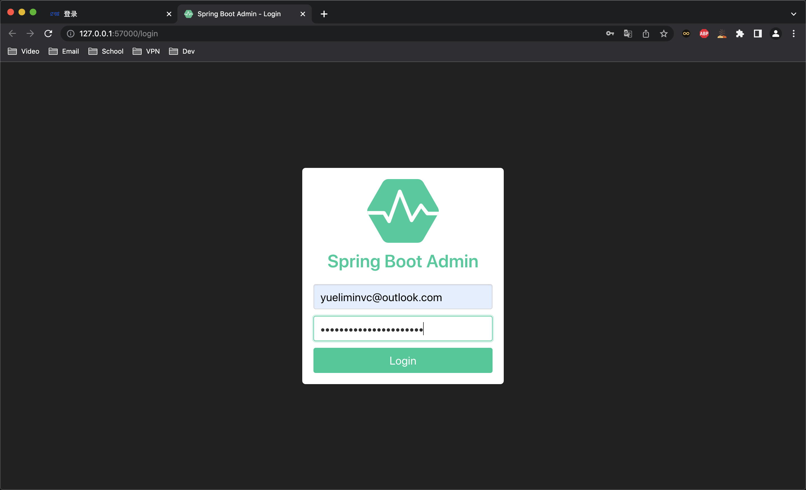
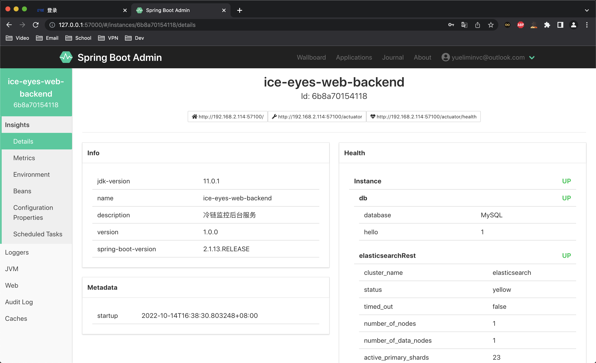
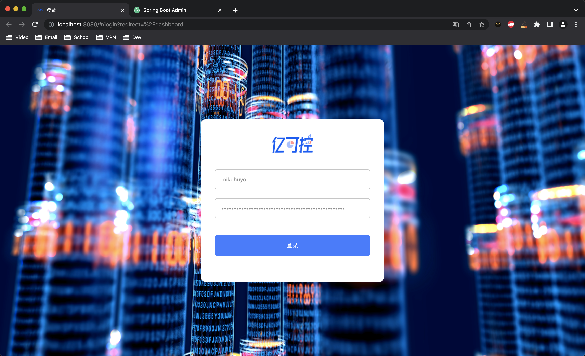
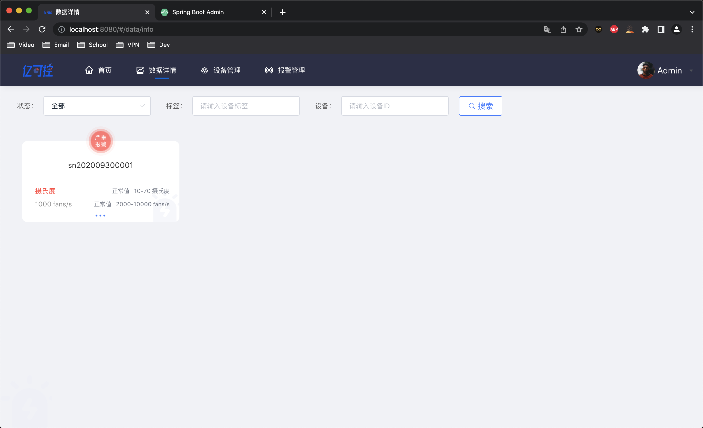
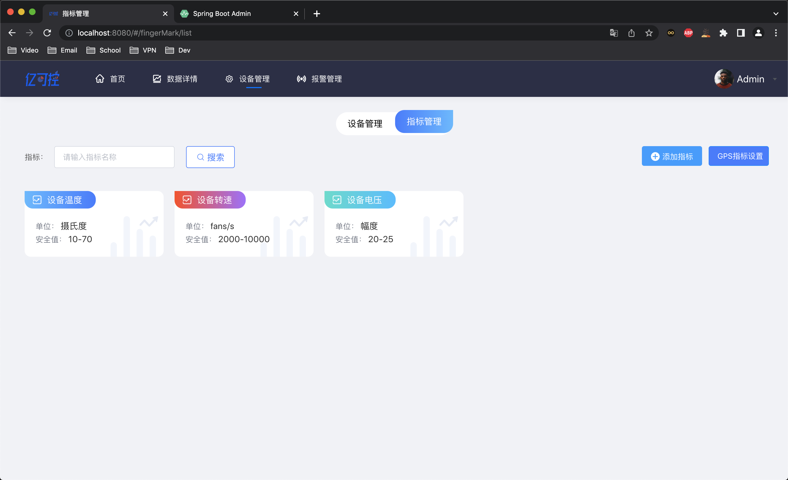

# 亿可控-硬件监控V1

[](https://github.com/mikuhuyo/hardware-monitor/blob/master/LICENSE)
[](https://github.com/mikuhuyo/hardware-monitor/issues)
[](https://github.com/mikuhuyo/hardware-monitor/stargazers)
[](https://github.com/mikuhuyo/hardware-monitor/network)


## 项目架构

Ps: 个人学习项目(话说16G内存也不够用啊) :D

### 技术架构



### 业务架构


## 项目介绍

### 物联网基本介绍

**物联网**(英文: Internet of Things, 缩写: IoT)起源于传媒领域, 是信息科技产业的第三次革命.

物联网是指通过信息传感设备, 按约定的协议, 将任何物体与网络相连接, 物体通过信息传播媒介进行信息交换和通信, 以实现智能化识别, 定位, 跟踪, 监管等功能.

在物联网应用中有三项关键技术, 分别是: 感知层, 网络传输层和应用层.

### 应用领域

- 智能家居
- 智慧交通
- 智能电网
- 智慧城市
- 智能汽车

### 核心功能

01)报文数据采集与指标解析: 整个系统的数据来源是通过接收设备发送过来的报文消息, 在系统中定义主题和消息内容字段的指标数据为过滤条件, 从而对消息进行收集和分析

02)报警监控: 通过和系统中定义的各种告警级别数据进行对比, 一旦发现触发到告警级别的消息, 就会通过和告警关联配置的webhook来将告警信息透传到其它系统

03)GPS定位监控: 采集每台设备的GPS定位, 并提供设备位置查询功能

04)数据看板: 提供丰富的自定义数据看板

### 业务模块

- 图形监控模块
  - 实时监控
  - 设备分布
  - 异常设备监控
- 数据详情展示模块
  - 设备状态
  - 指标信息
  - 报警信息
- 看板管理模块
  - 选择看板
  - 自定义看板
- 设备管理模块
  - 设备管理
  - 指标管理
- 报警管理模块
  - 报警日志
  - 报警管理
- 系统管理模块
  - 系统设置

## 项目演示

### 服务监控





### 登录



### 设备监控



### 参数设置



## 环境与工具说明

### 开发机器

- 内存: 16GB
- 显卡: 无需求
- CPU: 不能太拉跨

### 环境

| 环境                      | 说明                |
|-------------------------|-------------------|
| Java 11                 | 尽量使用java8及以上版本    |
| Maven 3.6               | 尽量使用maven3.6及以上版本 |
| Postman                 | 这个随便              |
| Docker Or DockerDesktop | 不要选择最新版本          |

### 使用工具

| 工具                | 说明                              |
|-------------------| --------------------------------- |
| ElasticSearch 7.2 | GEO存储, 设备信息存储, 告警日志存储 |
| Emqx  4           | mqtt消息服务器                     |
| MySQL 8           | 关系数据存储                        |
| Redis 6           | 缓存                              |

## 启动手册

### 一键搭建环境

进入到项目的根目录中的`doc/docker-compose/`目录下, 运行: `docker-compose up -d`

需要有docker-compose环境

如果是服务器部署环境, 需求修改`ip`相关配置

ps: 更多环境配置 -> https://github.com/mikuhuyo/docker-dev-config

### 初始化MySQL

在配置好的机器上执行`doc/mysql/init.sql`

### 初始化ElasticSearch

进入到`Kibana`中初始化索引(`ElasticSearch`无法自动识别`GEO`数据, 因此需要我们自己设置)

```shell
# PUT cold_storage_device_geo

# PUT cold_storage_device_geo/_mapping
{
  "properties": {
    "deviceId": {
      "type": "text"
    },
    "location": {
      "type": "geo_point"
    }
  }
}

# GET cold_storage_device_geo
```

### 生成数据

执行`MockTest.java`中的两个`mock`方法(又先后顺序, 先执行`testMockDeviceData`在执行`testMockAlarmLogData`)

### 启动服务

01)WebMonitoringApplication-监控服务

02)WebBackendApplication-后端服务

## 关于todo

### todo说明

主要是技术选型上的问题, 使用ElasticSearch进行时间维度的查询没有预期那么好, 比较费时(也不说比较费时就是非常耗时).

由于我想要直接使用ElasticSearch一套带走显然是不科学的, 采取`influxdb`这种正儿八经的时序数据库才是王道.

这一块没有处理好, 后面几个功能就没有实现(有时间再说).

### todo列表

## 特别鸣谢

### 关注者

[](https://github.com/mikuhuyo/hardware-monitor/stargazers)

### 收藏者

[](https://github.com/mikuhuyo/hardware-monitor/network/members)

## 整理不易-请这个b喝杯水?


---


